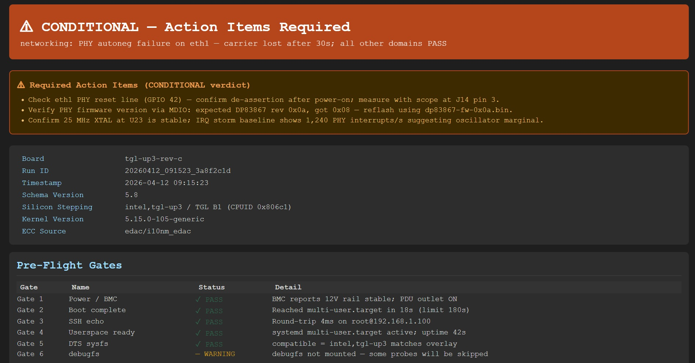

# PoAgent — Power-On Diagnostic Agent

**Version 5.8.0** · Apache-2.0 · Python ≥ 3.11

PoAgent is an autonomous, multi-domain board bring-up analysis system. It connects to an embedded Linux target over SSH or serial, runs a structured pipeline of pre-flight gates, hardware sanity checks, and LLM-powered domain agents, and produces a signed HTML + JSON diagnostic report with a machine-readable verdict.

**Key capabilities:**
- 10 hardware diagnostic domains (power, memory, storage, networking, display, audio, and more)
- Fully autonomous — no manual interpretation needed; verdict is `PASS / FAIL / CONDITIONAL / INCOMPLETE`
- Works over SSH or serial/UART; supports fleet/batch mode for multiple boards in parallel
- Spec PDF ingestion — feed the board's datasheet and PoAgent extracts rail voltages and clock frequencies automatically
- HMAC-signed reports for tamper-evident archival

---

## Sample Report



---

## Table of Contents

1. [Quick Start](#quick-start)
2. [Installation](#installation)
3. [What Is Supported](#what-is-supported)
4. [Architecture & Agent Orchestration](#architecture--agent-orchestration)
5. [Pipeline Diagram](#pipeline-diagram)
6. [Subsystems & Domains](#subsystems--domains)
7. [CLI Reference](#cli-reference)
8. [Configuration Reference](#configuration-reference)
9. [Output & Report Format](#output--report-format)
10. [Running Tests](#running-tests)
11. [Diagnostic Codes](#diagnostic-codes)
12. [Environment Variables](#environment-variables)
13. [Feature Reference](#feature-reference)

---

## Quick Start

### 1. Install

```bash
git clone <repo-url>
cd power-on_agent
pip install -e ".[dev]"
export ANTHROPIC_API_KEY="sk-ant-..."
```

### 2. Run full diagnostics via SSH

```bash
poagent \
  --host root@192.168.1.100 \
  --dts path/to/board.dts \
  --overlay path/to/overlay.yaml \
  --board-name my-board-rev-b \
  --output-dir /var/log/poagent
```

### 3. Check the verdict

```
Verdict: PASS
  HTML: /var/log/poagent/<run-id>/report.html
  JSON: /var/log/poagent/<run-id>/report.json
```

Exit code `0` = PASS, `1` = FAIL, `2` = CONDITIONAL, `3` = INCOMPLETE, `4` = PREFLIGHT_FAIL, `5` = DRY_RUN_FAIL.

---

### More usage examples

**Run via serial port**

```bash
poagent \
  --serial /dev/ttyUSB0 \
  --baud 115200 \
  --dts path/to/board.dts \
  --overlay path/to/overlay.yaml
```

**Run only specific subsystems**

```bash
poagent --host root@192.168.1.100 --dts board.dts \
  --subsystem power_clocking \
  --subsystem compute_memory \
  --subsystem storage
```

**Validate a DTS overlay without connecting to a board**

```bash
poagent --dry-run --dts path/to/board.dts --overlay path/to/overlay.yaml
# Exit 0 = valid, exit 5 = invalid
```

**Run with spec PDF ingestion**

```bash
poagent \
  --host root@192.168.1.100 \
  --dts board.dts \
  --spec-pdf /path/to/HW_Spec.pdf \
  --spec-page-range 1 80
```

**Fleet / batch mode (multiple boards in parallel)**

```bash
poagent --batch --fleet-csv boards.csv --fleet-concurrency 8 --output-dir /var/log/fleet
```

`boards.csv` format:
```csv
board_name,host,dts,overlay
board-alpha,root@10.0.0.1,boards/alpha.dts,overlays/alpha.yaml
board-beta,root@10.0.0.2,boards/beta.dts,overlays/beta.yaml
```

**Resume an interrupted run**

```bash
poagent --host root@192.168.1.100 --dts board.dts \
  --resume <run-uuid>
```

**Re-analyze from cached results (no board connection)**

```bash
poagent --reanalyze --resume <run-uuid> --output-dir /var/log/poagent
```

**Verify a signed report**

```bash
export POAGENT_SIGNING_KEY="my-signing-key"
poagent --verify-report /var/log/poagent/<run-id>/report.html
```

**Validate an overlay file**

```bash
poagent --validate-overlay path/to/overlay.dts
```

---

## Installation

### Prerequisites

- Python ≥ 3.11
- `dtc` (Device Tree Compiler) — for DTS overlay validation
- SSH access to the target board OR a serial port
- Anthropic API key

```bash
# Install dtc (Debian/Ubuntu)
sudo apt install device-tree-compiler

# Install dtc (Fedora/RHEL)
sudo dnf install dtc
```

### Install PoAgent

```bash
# From source (recommended for development)
git clone <repo-url>
cd power-on_agent
pip install -e ".[dev]"

# Production install
pip install .

# With fleet/batch support
pip install ".[fleet]"
```

### Store API Key (recommended)

```bash
# Via keyring (most secure — key never touches config files)
python -c "import keyring; keyring.set_password('poagent', 'anthropic_api_key', 'sk-ant-...')"

# Via environment variable
export ANTHROPIC_API_KEY="sk-ant-..."

# Via CLI (least secure — visible in process table)
poagent --api-key sk-ant-...
```

---

## What Is Supported

### Transport

| Transport | How | Notes |
|-----------|-----|-------|
| SSH | `--host user@host:port` | Default; uses paramiko + private key or password |
| Serial / UART | `--serial /dev/ttyUSB0 --baud 115200` | Auto-baud detection supported |

### Hardware Platforms

Overlay properties define what the agent checks. Any Linux-based embedded board is supported. Built-in SoC clock topology databases:

| SoC Family | Compatible String | Clock DB |
|------------|-------------------|----------|
| Qualcomm SC8280X | `qcom,sc8280x` | PLLs, GCC, CAMCC, DISPCC |
| Intel Tiger Lake | `intel,tgl-up3` | FUSE PLL, Ring PLL, SA PLL |
| NXP i.MX8 | `fsl,imx8` | ARM PLL, System PLL, Audio PLL |
| Rockchip RK3588 | `rockchip,rk3588` | GPLL, CPLL, NPLL |
| MediaTek MT8195 | `mediatek,mt8195` | ARMPLL, UNIVPLL, MSDCPLL |
| TI AM65 | `ti,am654` | MAIN PLL, MCU PLL |
| Generic | any | Empty clock DB (CLOCK_TOPOLOGY_UNKNOWN warning) |

### LLM Backend

- **Model:** `claude-sonnet-4-6` (default), configurable via `--model`
- **API:** Anthropic Claude API (`anthropic>=0.40.0`)
- **Key sources (priority order):** `keyring` → `POAGENT_ANTHROPIC_KEY` env → `ANTHROPIC_API_KEY` env → `--api-key` CLI flag

---

## Architecture & Agent Orchestration

PoAgent runs a fixed pipeline with three categories of agents:

```
┌────────────────────────────────────────────────────────────────────────────┐
│                           PoAgent Pipeline                                 │
│                                                                            │
│  ┌──────────────┐                                                          │
│  │  Phase 0     │  Boot context capture (Python-only, no LLM)             │
│  │  (pre-run)   │  IRQ storm baseline, EDAC t0, kernel panic scan,        │
│  │              │  silicon stepping, watchdog state, AER baseline          │
│  └──────┬───────┘                                                          │
│         │                                                                  │
│  ┌──────▼───────┐                                                          │
│  │  Pre-Flight  │  Gates 1–6 (Python-only, no LLM)                        │
│  │  Gates       │  G1: Power/BMC, G2: Boot wait, G3: SSH echo,            │
│  │              │  G4: Userspace ready, G5: DTS sysfs, G6: debugfs        │
│  └──────┬───────┘                                                          │
│         │ ABORT on any critical gate failure                               │
│  ┌──────▼───────┐                                                          │
│  │  Rail        │  PMBus/hwmon/regulator voltage reads                     │
│  │  Sanity      │  500ms settle delay + 3-read median per rail            │
│  │  Barrier     │  Hard FAIL if critical rail out of tolerance             │
│  └──────┬───────┘                                                          │
│         │                                                                  │
│  ┌──────▼───────────────────────────────────────────────┐                 │
│  │  Phase 1 — Sequential LLM Agents                     │                 │
│  │                                                       │                 │
│  │  ┌─────────────────────┐  ┌───────────────────────┐  │                 │
│  │  │  Power & Clocking   │→ │  Compute & Memory     │  │                 │
│  │  │  (domain agent)     │  │  (domain agent)       │  │                 │
│  │  └─────────────────────┘  └───────────────────────┘  │                 │
│  └──────┬───────────────────────────────────────────────┘                 │
│         │                                                                  │
│  ┌──────▼───────┐                                                          │
│  │  Clock       │  Walk clock dependency graph                            │
│  │  Cascade     │  Demote Phase 2 domains whose clock failed in Phase 1   │
│  │  Resolver    │  Tag LOW_CONFIDENCE_PHASE1_INCOMPLETE if Phase 1 aborted│
│  └──────┬───────┘                                                          │
│         │                                                                  │
│  ┌──────▼───────────────────────────────────────────────┐                 │
│  │  Phase 2 — 8 Parallel LLM Domain Agents              │                 │
│  │                                                       │                 │
│  │  ┌──────────┐ ┌──────────┐ ┌──────────┐ ┌─────────┐ │                 │
│  │  │ Storage  │ │ Hi-Speed │ │ Display/ │ │Network- │ │                 │
│  │  │          │ │ Serial   │ │ Graphics │ │ ing     │ │                 │
│  │  └──────────┘ └──────────┘ └──────────┘ └─────────┘ │                 │
│  │  ┌──────────┐ ┌──────────┐ ┌──────────┐ ┌─────────┐ │                 │
│  │  │ Audio    │ │ Low-Speed│ │ Security/│ │ Sensors │ │                 │
│  │  │          │ │ Interface│ │ Crypto   │ │ & Misc  │ │                 │
│  │  └──────────┘ └──────────┘ └──────────┘ └─────────┘ │                 │
│  └──────┬───────────────────────────────────────────────┘                 │
│         │                  ↑ ThermalMonitorThread (dedicated SSH conn)     │
│  ┌──────▼───────┐                                                          │
│  │  Clock       │  Re-run cascade resolver on Phase 2 results             │
│  │  Cascade     │  Demote dependent_fail domains                          │
│  │  Resolver 2  │                                                          │
│  └──────┬───────┘                                                          │
│         │                                                                  │
│  ┌──────▼───────┐                                                          │
│  │  EDAC delta  │  t1 snapshot − t0 → DRAM_MARGINAL / DRAM_UNCORRECTABLE │
│  └──────┬───────┘                                                          │
│         │                                                                  │
│  ┌──────▼───────┐                                                          │
│  │  Triage      │  LLM agent synthesizes domain results                   │
│  │  Agent       │  Computes po_verdict (Python, deterministic)            │
│  └──────┬───────┘                                                          │
│         │                                                                  │
│  ┌──────▼───────┐                                                          │
│  │  Report      │  HTML + JSON + HMAC-SHA-256 signature                   │
│  │  Generation  │  Log rotation, audit log, board lock release            │
│  └──────────────┘                                                          │
└────────────────────────────────────────────────────────────────────────────┘
```

### Background Services (run throughout Phase 1 + 2)

| Service | Thread | Purpose |
|---------|--------|---------|
| Thermal Monitor | `ThermalMonitorThread` | Polls `/sys/class/thermal/*/temp` every 5s; aborts run if threshold exceeded |
| Watchdog Keepalive | `WatchdogKeepaliveThread` | Writes keepalive to `/dev/watchdog*` to prevent board reset during long runs |

---

## Pipeline Diagram

```
poagent --host root@192.168.1.100 --dts board.dts --overlay overlay.yaml
    │
    ├─► DTS parse + overlay validation (Python-only)
    ├─► Board lock acquire (/var/lock/poagent-<board>.lock)
    │
    ├─► [Phase 0]  Boot context capture
    │       ├─ uname, kernel version, uptime
    │       ├─ IRQ storm baseline (/proc/interrupts × 2 samples)
    │       ├─ Kernel panic scan (dmesg, /var/log/kern.log)
    │       ├─ EDAC/ECC t0 snapshot
    │       ├─ Silicon stepping (CPUID, /proc/cpuinfo, stepping_reader)
    │       ├─ Watchdog state (NOWAYOUT, timeout_s, conflict check)
    │       └─ PCIe AER baseline
    │
    ├─► [Gates 1–6]
    │       ├─ Gate 1: BMC/PDU power verification
    │       ├─ Gate 2: Boot-complete poll (180s timeout)
    │       ├─ Gate 3: SSH/serial echo round-trip
    │       ├─ Gate 4: Userspace detection (systemd → BusyBox → Method 5)
    │       ├─ Gate 5: DTS sysfs cross-check
    │       └─ Gate 6: debugfs mount (WARNING only, never ABORT)
    │
    ├─► [Rail Sanity Barrier]
    │       ├─ 500ms settle delay
    │       ├─ Per-rail: PMBus READ_VOUT → hwmon → regulator sysfs
    │       ├─ 3-read median, ±tolerance check
    │       └─ FAIL → pipeline aborts; UNCERTAIN → proceeds with warning
    │
    ├─► [Phase 1 — Sequential]
    │       ├─ Power & Clocking agent (LLM + probes)
    │       └─ Compute & Memory agent (LLM + probes)
    │
    ├─► [Cascade Resolver — Pass 1]
    │
    ├─► [Phase 2 — Parallel, 8 domains]
    │       └─ Each: probes → LLM analysis → DomainResult
    │
    ├─► [Cascade Resolver — Pass 2]
    │
    ├─► [EDAC t1 + delta]
    │
    ├─► [Triage Agent]  →  po_verdict computation
    │
    └─► [Report]  →  HTML + JSON + HMAC signature
                      board lock release + log rotation
```

---

## Subsystems & Domains

PoAgent analyzes 10 diagnostic domains. Each domain has a dedicated LLM agent and a set of registered probes:

| Domain | Key | Phase | What Is Checked |
|--------|-----|-------|-----------------|
| Power & Clocking | `power_clocking` | 1 | VR output, clock lock status, PLL state, DRAM training log, PMBus rails, regulator tree |
| Compute & Memory | `compute_memory` | 1 | CPU online state, cache coherency, EDAC/ECC errors, memtester (optional), GIC/interrupt controller |
| Storage | `storage` | 2 | NVMe presence + SMART, UFS health, eMMC, SPI-NOR write-protect state, fio (optional) |
| High-Speed Serial | `highspeed_serial` | 2 | PCIe link speed/width, USB 3.x enumeration, XHCI state, AER error log |
| Display & Graphics | `display_graphics` | 2 | DRM/KMS connector state, panel power, backlight, framebuffer presence |
| Networking | `networking` | 2 | Ethernet link state, PHY autoneg, carrier detect, RX/TX counters, USB-C PD contract |
| Audio | `audio` | 2 | ALSA card enumeration, codec I2C response, DAPM path state |
| Low-Speed Interface | `lowspeed_interface` | 2 | UART/I2C/SPI device presence, I2C bus scan, GPIO mux conflicts, baud detection |
| Security & Crypto | `security_crypto` | 2 | TPM presence + PCR, Intel ME manufacturing mode, TRNG entropy quality, IOMMU binding |
| Sensors & Misc | `sensors_misc` | 2 | IIO sensor presence, BME280/MPU6050 enumeration, voltage/temp sensor reads |

### Probe Tiers

Each domain has probes in three execution tiers:

| Tier | Key | When Run | Typical Duration | LLM Call? |
|------|-----|----------|-----------------|-----------|
| FAST | `FAST` | Always | < 5s | No |
| STANDARD | `STANDARD` | Default | 5–30s | Yes |
| SLOW | `SLOW` | `--allow-destructive-tests` | 30s–10min | Yes |

---

## CLI Reference

```
usage: poagent [OPTIONS]

Connection:
  --host HOST[:PORT]        SSH target (user@host or host). Port defaults to 22.
  --serial DEVICE           Serial device (e.g. /dev/ttyUSB0). Exclusive with --host.
  --port PORT               SSH port (default: 22).
  --baud BAUD               Serial baud rate (default: 115200).
  --ssh-key PATH            SSH private key. Falls back to ~/.ssh/id_rsa.
  --ssh-user USER           SSH username (default: root).
  --ssh-password PASSWORD   SSH password. Prefer --ssh-key or keyring.

Board configuration:
  --dts PATH                Path to board .dts file. Required for normal run.
  --overlay PATH            Path to PoAgent overlay .yaml/.json file.
  --board-name NAME         Board identifier for lock file and report naming.
  --confirm-overlay {interactive,pre_validated,strict}
                            Overlay confirmation mode (default: interactive).

Domain/subsystem selection:
  --subsystem DOMAIN        Run only specified domain(s). Repeatable.
                            Valid: power_clocking, compute_memory, storage,
                            highspeed_serial, display_graphics, networking,
                            audio, lowspeed_interface, security_crypto, sensors_misc

Run modes:
  --dry-run                 Validate DTS + overlay only (no board). Exit 0 or 5.
  --resume RUN_ID           Resume an interrupted run.
  --reanalyze               Re-run triage from cached Phase 2 results (no board).
  --force-resume            Resume even if board lock is stale.
  --allow-destructive-tests Enable SLOW probes (memtester, fio). Caution: may corrupt data.
  --unsafe-shutdown-mode {ci_mode,production_mode}
                            Shutdown safety mode (default: production_mode).

Watchdog keepalive:
  --watchdog-keepalive {auto,warn,disable}
                            auto=spawn keepalive thread (limits SSH to 2 concurrent),
                            warn=detect + warn only (default),
                            disable=write V to stop watchdog.

Validation utilities:
  --validate-overlay PATH   Validate an overlay file and exit. Returns 0 or 1.
  --verify-report PATH      Verify HMAC-SHA-256 signature of an HTML report.

Spec ingestion:
  --spec-pdf PATH           Path to board spec PDF. Ingested before analysis.
  --spec-csv PATH           Path to rail/power-spec CSV. Merged with overlay.
  --spec-page-range N M     Page range for --spec-pdf (1-based inclusive).

Batch / fleet mode:
  --batch                   Run in batch/fleet mode. Requires --fleet-csv.
  --fleet-csv PATH          CSV with fleet board definitions.
  --fleet-concurrency N     Parallel boards in fleet mode (default: 4).

Output:
  --output-dir DIR          Directory for reports and logs (default: /var/log/poagent).
  --run-id UUID             Explicit run ID. Auto-generated if omitted.
  --json-only               Skip HTML report, output JSON only.
  --no-sign                 Skip HMAC-SHA-256 report signing.

LLM / API:
  --api-key KEY             Anthropic API key.
  --model MODEL             Claude model (default: claude-sonnet-4-6).
  --agent-timeout SECONDS   Per-domain agent wall-clock timeout (default: 120).
  --max-agent-iterations N  Max LLM tool-use iterations per domain (default: 10).

Logging:
  --log-level {DEBUG,INFO,WARNING,ERROR}
                            Log verbosity (default: INFO).
  --log-dir DIR             Override log directory.
```

### Exit Codes

| Code | Verdict | Meaning |
|------|---------|---------|
| 0 | PASS | All diagnostics passed |
| 1 | FAIL | One or more critical failures |
| 2 | CONDITIONAL | Issues present; board may function with caveats |
| 3 | INCOMPLETE | Analysis could not fully complete |
| 4 | PREFLIGHT_FAIL | Pre-flight gate failure (board not ready) |
| 5 | DRY_RUN_FAIL | Dry-run validation failed |

---

## Configuration Reference

All settings can be overridden via environment variables or `load_config()`. CLI flags take precedence.

| Key | Default | Description |
|-----|---------|-------------|
| `host` | `""` | SSH target hostname |
| `port` | `22` | SSH port |
| `ssh_user` | `"root"` | SSH username |
| `ssh_key_file` | `"~/.ssh/id_rsa"` | SSH private key path |
| `board_name` | `"unknown"` | Board identifier |
| `serial_port` | `""` | Serial device path |
| `serial_baud` | `115200` | Serial baud rate |
| `baud_autodetect` | `True` | Auto-detect baud rate |
| `max_concurrent_ssh` | `3` | Max parallel SSH connections |
| `ssh_keepalive_interval_s` | `30` | SSH keepalive interval |
| `boot_wait_timeout` | `180` | Gate 2 boot poll limit (seconds) |
| `min_uptime_seconds` | `10` | Gate 4 minimum uptime required |
| `gate4_sentinel_path` | `"/tmp/poagent_ready"` | Sentinel file for Gate 4 BusyBox detection |
| `gate4_sentinel_stable_count` | `3` | Consecutive checks required |
| `barrier_pre_read_settle_ms` | `500` | Rail barrier settle delay before reads |
| `irq_storm_threshold` | `1000` | IRQ events/second/CPU to trigger storm warning |
| `irq_storm_sample_ms` | `1000` | IRQ sampling window |
| `per_cpu_threshold` | `True` | Normalize IRQ rate by CPU count |
| `thermal_poll_interval_s` | `5` | Thermal monitor poll interval |
| `cooldown_s` | `60` | Thermal cooldown wait on threshold |
| `thermal_zone_thresholds` | `{"cpu-thermal": 95, ...}` | Thermal abort thresholds per zone |
| `agent_timeout_seconds` | `120` | Per-domain LLM agent wall-clock timeout |
| `watchdog_keepalive` | `"warn"` | Watchdog mode: `auto`, `warn`, `disable` |
| `watchdog_keepalive_interval_s` | `10` | Keepalive write interval |
| `watchdog_conflict_threshold_s` | `120` | Watchdog conflict detection threshold |
| `memtester_max_mb` | `256` | Maximum RAM to test with memtester |
| `memtester_fraction` | `0.6` | Fraction of available RAM to use |
| `allow_destructive_tests` | `False` | Enable memtester/fio (SLOW probes) |
| `unsafe_shutdown_mode` | `"ci_mode"` | NVMe unsafe shutdown mode |
| `model` | `"claude-sonnet-4-6"` | Claude model |
| `api_max_retries` | `5` | API retry limit |
| `api_max_wait_s` | `120` | API max retry wait |
| `log_retention_days` | `30` | Age-based log rotation threshold |
| `log_max_total_mb` | `500` | Size-based log rotation limit |
| `log_size_rotation_exempt` | `False` | Disable size-based rotation |
| `log_active_atime_window_s` | `3600` | Protect recently-accessed log dirs |
| `overlay_confirm_mode` | `"interactive"` | Overlay review mode |
| `fleet_workers` | `8` | Batch mode parallelism |

---

## Output & Report Format

### Directory Structure

Each run creates a timestamped directory:

```
/var/log/poagent/
└── <run-id>/                          # UUID-based run directory
    ├── report.html                    # HMAC-signed HTML report (human-readable)
    ├── report.json                    # Machine-readable JSON triage output
    ├── board_commands.jsonl           # Full audit log of all commands sent to board
    ├── phase2_cache.json              # Cached Phase 2 results (for --reanalyze)
    └── logs/
        └── poagent.log                # Structured JSON logs
```

### Verdict Logic

`po_verdict` is computed deterministically by Python (not LLM):

```
PASS        ← all domain statuses: pass or warning
CONDITIONAL ← any domain: warning (with silicon stepping fallback or kernel panics)
FAIL        ← any domain: fail, barrier_failed=True
INCOMPLETE  ← preflight_aborted=True, or no domain results collected
```

Domain status cascade:

```
pass          → verdict weight 0 (PASS)
warning       → verdict weight 0 (PASS)
conditional   → verdict weight 1 (CONDITIONAL)
aborted       → verdict weight 1 (CONDITIONAL)
fail          → verdict weight 2 (FAIL)
dependent_fail→ grouped under root cause; same weight as fail
```

### HTML Report — Key Sections

The HTML report contains:

1. **Header** — Board name, run ID, timestamp, verdict badge
2. **Verdict Box** — Color-coded: green (PASS), amber (CONDITIONAL), red (FAIL/INCOMPLETE)
3. **Action Items** — LLM-generated remediation steps (CONDITIONAL/FAIL verdicts)
4. **Pre-Flight Summary** — Gate 1–6 results, abort gate if any
5. **Rail Sanity Barrier** — Per-rail voltage readings with pass/fail/uncertain status
6. **Domain Results** — Expandable sections per domain:
   - Status badge
   - Summary paragraph
   - Findings list (CRITICAL / WARNING / INFO)
   - Root cause hypothesis
   - Recommended actions
   - Raw probe data
7. **Boot Context** — Kernel version, uptime, silicon stepping, IRQ storm status, EDAC delta
8. **HMAC-SHA-256 Signature** — Embedded for integrity verification

### JSON Report Structure

```json
{
  "po_verdict": "PASS | FAIL | CONDITIONAL | INCOMPLETE",
  "po_verdict_reason": "string",
  "domain_summaries": [
    {
      "domain": "compute_memory",
      "status": "pass | fail | warning | conditional | aborted | dependent_fail",
      "summary": "...",
      "findings": [
        {
          "severity": "CRITICAL | WARNING | INFO",
          "code": "DRAM_MARGINAL",
          "message": "...",
          "evidence": {},
          "recommended_action": "..."
        }
      ],
      "root_cause_hypothesis": "...",
      "confidence": 0.95,
      "recommended_actions": ["..."],
      "confidence_tags": [],
      "cascade_root": null
    }
  ],
  "action_items": ["..."],
  "triage_summary": "...",
  "run_metadata": {
    "run_id": "...",
    "timestamp": "...",
    "board_name": "...",
    "model": "claude-sonnet-4-6"
  }
}
```

### Console Output Example

```
Starting PoAgent run 3a8f2c1d-... on 192.168.1.100
Output directory: /var/log/poagent/3a8f2c1d-...

[Phase 0] Capturing boot context...
[Gate 3] SSH echo: PASS
[Gate 4] Userspace: PASS (systemd multi-user.target active)
[Gate 6] debugfs: WARNING (not mounted — some probes will be skipped)
[Barrier] Rail VCC_CORE: 998mV / 1000mV expected (±5%) — PASS
[Barrier] Rail VCC_IO: 1798mV / 1800mV expected (±5%) — PASS
[Phase 1] power_clocking... PASS (42s)
[Phase 1] compute_memory... PASS (38s)
[Phase 2] Running 8 domain agents in parallel...
[Phase 2] storage............. PASS (67s)
[Phase 2] highspeed_serial..... PASS (54s)
[Phase 2] networking.......... CONDITIONAL (61s)
...

Verdict: CONDITIONAL

  HTML report: /var/log/poagent/3a8f2c1d-.../report.html
  JSON report: /var/log/poagent/3a8f2c1d-.../report.json
```

---

## Running Tests

### Prerequisites

```bash
pip install -e ".[dev]"
```

### Run the Full Unit Test Suite

```bash
python -m pytest tests/unit/ -v
```

Expected output: **341 tests, 0 failures** in ~33s.

### Run a Specific Test File

```bash
python -m pytest tests/unit/test_edac_tracker.py -v
python -m pytest tests/unit/test_rail_barrier.py -v
python -m pytest tests/unit/test_log_rotator.py -v
```

### Run Tests by Marker

```bash
# Unit tests only (no board required)
python -m pytest -m unit

# Slow tests (memtester, fio — require real hardware)
python -m pytest -m slow

# Integration tests (require board connection)
python -m pytest -m integration
```

### Run With Coverage

```bash
python -m pytest tests/unit/ --cov=poagent --cov-report=html
# Open htmlcov/index.html for detailed coverage report
```

### Run the Exhaustive Corner-Case Suite

The exhaustive test file (`test_exhaustive_corner_cases.py`) covers 95 additional edge cases:

```bash
python -m pytest tests/unit/test_exhaustive_corner_cases.py -v
```

Covers:
- ECC counter wrap-around, `window_min=0`, u32 max, partial `None`
- Rail barrier `tolerance_pct > 100`, `expected_mv=0`, unknown status
- Watchdog thread lifecycle: clean stop on `abort_event`, `interval_s=0`
- IRQ storm: 0ms sample, single CPU, malformed CPU list, inverted range
- Log rotator: `max_total_mb=0`, `retention_days=100000`, FD leak detection
- DTS parser: empty file, no-comma compatible, unclosed brace, circular supply
- Overlay validator: boundary values (100/5000mV, 1–20% tolerance, gen 1–5), multi-error
- Cascade resolver: 1000-deep chain (no recursion overflow), ghost clocks
- Credentials: 19-char rejected, 20-char accepted, whitespace-only rejected
- Triage: all 6 verdict types, barrier failed, kernel panics, INCOMPLETE
- Memory leak checks: `tracemalloc` over 1000 iterations of each hot path
- Thread leak detection: `threading.active_count()` before/after lifecycle tests
- File descriptor leak detection: `/proc/self/fd` count before/after 30 calls

### Test File Reference

| File | Tests | What It Covers |
|------|-------|---------------|
| `test_edac_tracker.py` | 13 | ECC snapshot, delta, EDAC source detection |
| `test_rail_barrier.py` | 13 | Voltage reads, barrier report, settle delay |
| `test_log_rotator.py` | 10 | Age/size rotation, active protection, exemption |
| `test_preflight.py` | 14 | Gates 3, 4, 6; PreFlightReport; Method 5 |
| `test_watchdog_keepalive.py` | 15 | Thread lifecycle, SELinux, conflict modes |
| `test_irq_storm.py` | 12 | IRQStorm detection, CPU parsing, rate calc |
| `test_cascade_resolver.py` | 11 | Phase 1 abort tagging, cascade demote, chains |
| `test_clock_topology.py` | 21 | ClockEntry, ClockTopologyDB, KNOWN_DOMAINS |
| `test_credentials.py` | 13 | API key resolution, masking, validation |
| `test_overlay_validator.py` | 17 | Bounds (100–5000mV, tolerance, PCIe gen) |
| `test_dts_parser.py` | 12 | parse_dts, parse_po_agent_properties, cycles |
| `test_probe_registry.py` | 13 | @register_probe, ProbeBase, get_probes tiers |
| `test_triage.py` | 22 | compute_po_verdict, TriageOutput, all verdicts |
| `test_report_generator.py` | 17 | HTML/JSON generation, CONDITIONAL action items |
| `test_signing.py` | 16 | sign_report, verify_report, HMAC |
| `test_domain_result.py` | 11 | DomainResult dataclass, Finding |
| `test_exhaustive_corner_cases.py` | 95 | Corner cases + memory/resource leaks |

---

## Diagnostic Codes

All codes are string constants from `poagent/codes.py`. They appear in report findings and structured logs.

### Gate / Pre-Flight Codes

| Code | Meaning |
|------|---------|
| `BOARD_LOCK_CONFLICT` | Another PoAgent run is active on this board |
| `DTS_PARSE_ERROR` | DTS file has syntax or cycle error |
| `DTS_VERSION_MISMATCH_WARNING` | DTS built for different kernel than running |
| `GATE4_METHOD5_ONLY` | Userspace detected only via `/proc/1/fd` (unreliable) |
| `GATE4_SENTINEL_UNSTABLE` | Sentinel file not stable between checks |

### Rail / Barrier Codes

| Code | Meaning |
|------|---------|
| `RAIL_SANITY_FAIL` | Critical rail out of tolerance — FAIL verdict |
| `BARRIER_UNCERTAIN` | Rail read unavailable (DDR-backed regulator sysfs) |
| `NO_PMBUS_AVAILABLE` | Rail has no PMBus/hwmon/regulator source |
| `SUSPICIOUS_LOW_VOLTAGE` | 100–499mV rail (valid on modern SoCs, verify name) |

### EDAC / ECC Codes

| Code | Meaning |
|------|---------|
| `DRAM_MARGINAL` | CE rate > 100 correctable errors/minute |
| `DRAM_UNCORRECTABLE_ERROR` | Any uncorrectable ECC error (UE delta > 0) |
| `ECC_NOT_MONITORABLE` | No EDAC/ECC source found on this platform |

### Clock / Cascade Codes

| Code | Meaning |
|------|---------|
| `CLOCK_TOPOLOGY_UNKNOWN` | SoC not in built-in clock DB |
| `ORCHESTRATOR_WARNING` | Phase 1 aborted; cascade analysis unavailable |

### Watchdog Codes

| Code | Meaning |
|------|---------|
| `WATCHDOG_RUN_CONFLICT` | Another process holds the watchdog device |
| `WATCHDOG_KEEPALIVE_ACTIVE` | PoAgent is petting the watchdog |
| `WATCHDOG_NOWAYOUT_CANNOT_DISABLE` | `NOWAYOUT` flag set; cannot safely disable |
| `WATCHDOG_SELINUX_BLOCKED` | SELinux policy blocks watchdog write |

### Kernel / System Codes

| Code | Meaning |
|------|---------|
| `PANIC_DETECTED_WARNING` | Kernel panic in dmesg this boot |
| `OOM_KILL_IN_DMESG` | OOM killer fired during this boot |
| `SILICON_STEPPING_UNRESOLVED` | Could not read silicon stepping; verdict → CONDITIONAL |
| `IRQ_STORM_WARNING` | IRQ rate > threshold on at least one line |
| `THERMAL_ABORT` | Temperature exceeded threshold; run aborted |

### Security Codes

| Code | Meaning |
|------|---------|
| `INTEL_ME_MANUFACTURING_MODE` | Intel ME is in manufacturing mode (security issue) |
| `TRNG_STUCK_FAULT` | Hardware TRNG producing stuck bits |
| `TRNG_FIPS_FAIL` | TRNG failed FIPS 140-2 health test |
| `IOMMU_BINDING_FAIL` | Device not bound to IOMMU correctly |
| `PROBE_INTEGRITY_FAIL` | Probe manifest checksum mismatch |

### Storage Codes

| Code | Meaning |
|------|---------|
| `NVME_MEDIA_FAIL` | NVMe SMART media error count non-zero |
| `NVME_UNSAFE_SHUTDOWN_WARNING` | Excessive unsafe shutdowns on NVMe |
| `SPI_FLASH_WP_UNSET` | SPI NOR write-protect pin not asserted |

### Overlay / Validation Codes

| Code | Meaning |
|------|---------|
| `BOUNDS_VIOLATION` | Property value outside allowed range |
| `ZERO_VALUE_ERROR` | Critical property has value 0 (LLM hallucination likely) |
| `NO_CRITICAL_RAILS` | Overlay declares no `po-agent,critical` rails |

---

## Environment Variables

| Variable | Purpose |
|----------|---------|
| `ANTHROPIC_API_KEY` | Anthropic API key (fallback after keyring) |
| `POAGENT_ANTHROPIC_KEY` | Anthropic API key (takes precedence over `ANTHROPIC_API_KEY`) |
| `POAGENT_SIGNING_KEY` | HMAC-SHA-256 report signing key |
| `POAGENT_SSH_PASSWORD` | SSH password (never stored in config) |
| `POAGENT_SERIAL_PASSWORD` | Serial login password (never stored in config) |
| `POAGENT_MODEL` | Default Claude model (overrides dataclass default) |

---

## Feature Reference

### Overlay DTS Format

PoAgent uses custom `po-agent,*` DTS properties to define board-specific thresholds:

```dts
/dts-v1/;
/ {
    vcc_core {
        po-agent,expected-mv = <1000>;   /* nominal voltage in mV */
        po-agent,tolerance-pct = <5>;    /* ±5% tolerance */
        po-agent,critical;               /* barrier rail — FAIL if out of bounds */
        po-agent,pmbus-bus = <0>;        /* i2c bus for PMBus reads */
        po-agent,pmbus-addr = <0x60>;    /* PMBus device address */
    };

    vdd_mx {
        po-agent,expected-mv = <352>;    /* sub-500mV rail (valid on Qualcomm SoCs) */
        po-agent,tolerance-pct = <5>;
        po-agent,critical;
    };

    pcie_ep0 {
        po-agent,expected-pcie-gen = <4>;   /* expected PCIe generation (1–5) */
        po-agent,expected-link-width = <4>; /* expected link width (1–16) */
    };

    /* Human-review attestation — set by: poagent --validate-overlay */
    po-agent,human-reviewed = <1>;
};
```

**Overlay Bounds (all enforced by validator):**

| Property | Range | Notes |
|----------|-------|-------|
| `po-agent,expected-mv` | 100–5000 mV | 100–499mV emits `SUSPICIOUS_LOW_VOLTAGE` |
| `po-agent,tolerance-pct` | 1–20 % | 0% and >20% are hard errors |
| `po-agent,expected-pcie-gen` | 1–5 | PCIe Gen 6 = `BOUNDS_VIOLATION` |
| `po-agent,expected-link-width` | 1–16 | x32 and beyond = `BOUNDS_VIOLATION` |
| `po-agent,expected-ports-usb3` | 0–32 | |
| `po-agent,expected-ports-usb2` | 0–32 | |
| `po-agent,physically-present` | 0–1 | Set 0 for unpopulated slots |

### Board Lock

PoAgent acquires an exclusive lock per board (`/var/lock/poagent-<board-name>.lock`) to prevent concurrent runs. Use `--force-resume` to override a stale lock.

### HMAC-SHA-256 Report Signing

Reports are signed with HMAC-SHA-256 using `POAGENT_SIGNING_KEY`. The signature is embedded in the HTML. Verify with:

```bash
POAGENT_SIGNING_KEY="key" poagent --verify-report report.html
```

### Two-Pass Log Rotation

Logs are rotated after every run:

1. **Age pass** — delete run dirs older than `log_retention_days` (0 = disabled for ISO 26262 compliance)
2. **Size pass** — delete oldest run dirs until total < `log_max_total_mb` (skipped if `log_size_rotation_exempt=True`)

Active runs (accessed within `log_active_atime_window_s`) and `current_run_dir` are always protected.

### Spec PDF Ingestion

Board specification PDFs (schematic summaries, power trees) are ingested before analysis using the LLM to extract rail voltages, tolerances, and clock frequencies. These are merged with the overlay:

```bash
poagent --host root@192.168.1.100 --dts board.dts \
  --spec-pdf schematic.pdf --spec-page-range 15 45
```

### Audit Log

All commands sent to the board are logged in JSONL format (`board_commands.jsonl`) with:
- Timestamp
- Command string
- Exit code
- Stdout/stderr (truncated at 4KB)
- Probe name that issued the command

---

## Security Considerations

- SSH passwords are **never stored** in config files; they are read from `POAGENT_SSH_PASSWORD` at connect time
- API keys are read from keyring, then environment variables; never from config files
- The `po-agent,human-reviewed = <1>` property in overlays serves as a commit-time attestation that an engineer reviewed the LLM-generated overlay before use
- Report HMAC signing provides tamper detection for archived reports
- `allow_destructive_tests=False` by default; `memtester` and `fio` must be explicitly enabled
- `NOWAYOUT` watchdog detection prevents unsafe watchdog disable attempts
