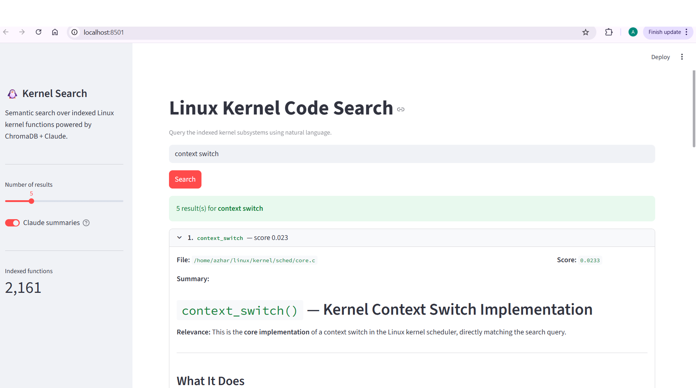

# Linux Kernel Code Search

RAG-powered semantic search over Linux kernel functions. Parse kernel C source with tree-sitter, embed with `all-MiniLM-L6-v2`, store in ChromaDB, and get Claude-generated summaries through a Streamlit UI.

## Architecture

```
kernel source (.c files)
        │
        ▼
   parser.py          ← tree-sitter-c AST → function dicts
        │                (name, signature, docstring, body snippet)
        ▼
   indexer.py         ← sentence-transformers embeddings → ChromaDB upsert
        │
        ▼
   retriever.py       ← semantic search + Claude summaries
        │
        ▼
     ui.py            ← Streamlit search interface
```

`sync.py` handles incremental updates by diffing git commits and re-indexing only changed files.
`app.py` exposes the same functionality as a FastAPI REST API.

## Setup

### 1. Install dependencies

```bash
python3 -m venv .venv
source .venv/bin/activate
pip install -r requirements.txt
```

### 2. Configure environment

```bash
cp .env.example .env
```

Edit `.env`:

```
ANTHROPIC_API_KEY=sk-ant-...
KERNEL_PATH=/path/to/linux   # path to a cloned Linux kernel repo
```

If you don't have a kernel clone yet:

```bash
git clone --depth=1 https://git.kernel.org/pub/scm/linux/kernel/git/torvalds/linux.git
```

### 3. Configure subsystems

Edit `config.py` to select which kernel subdirectories to index:

```python
SUBSYSTEMS = [
    "kernel/sched",   # scheduler
    # "mm",           # memory management
    # "net/core",     # networking core
]
```

### 4. Index

```bash
# Full index of all configured subsystems
python indexer.py --full

# Incremental update for specific files
python indexer.py --files /path/to/linux/kernel/sched/core.c
```

## Running

### Streamlit UI (recommended)

```bash
streamlit run ui.py
```

Opens at http://localhost:8501.



- Enter a natural language query (e.g. `task preemption`, `spinlock acquire`, `CFS fairness`)
- Toggle **Claude summaries** on/off in the sidebar
- Adjust the number of results with the slider

### FastAPI server

```bash
uvicorn app:app --reload --port 8000
```

Docs at http://localhost:8000/docs.

| Endpoint | Method | Description |
|---|---|---|
| `/search` | POST | Semantic search, optional Claude summaries |
| `/stats` | GET | Number of indexed functions |
| `/sync` | POST | Trigger incremental git sync |

Example request:

```bash
curl -s -X POST http://localhost:8000/search \
  -H "Content-Type: application/json" \
  -d '{"query": "context switch", "limit": 3, "summaries": true}' | jq
```

### CLI search

```bash
python retriever.py context switch overhead
```

## Incremental sync

After the initial index, keep the database up to date when the kernel repo advances:

```bash
python sync.py                            # auto-detects KERNEL_PATH from .env
python sync.py --kernel-path /path/to/linux
```

This fetches new commits, diffs against the last recorded HEAD, and re-indexes only the changed `.c` files that fall under the configured `SUBSYSTEMS`.

## Files

| File | Purpose |
|---|---|
| `config.py` | Central configuration (model, paths, subsystems) |
| `parser.py` | tree-sitter-c AST → function dicts |
| `indexer.py` | Embed functions and upsert into ChromaDB |
| `retriever.py` | Semantic search + Claude summarization |
| `sync.py` | Incremental git-based re-indexing |
| `ui.py` | Streamlit search UI |
| `app.py` | FastAPI REST API |
| `setup.sh` | One-shot setup script (clone kernel + first index) |
